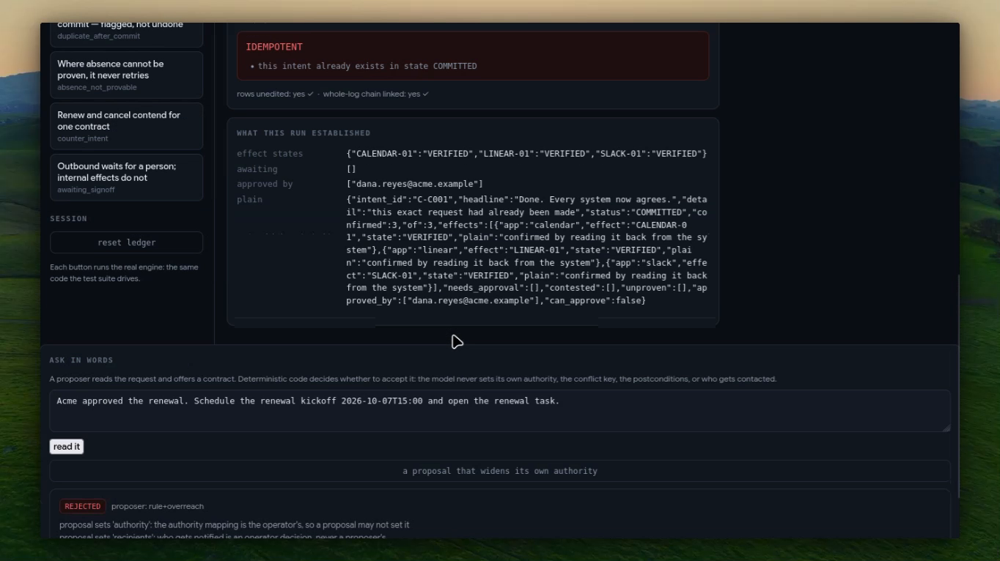
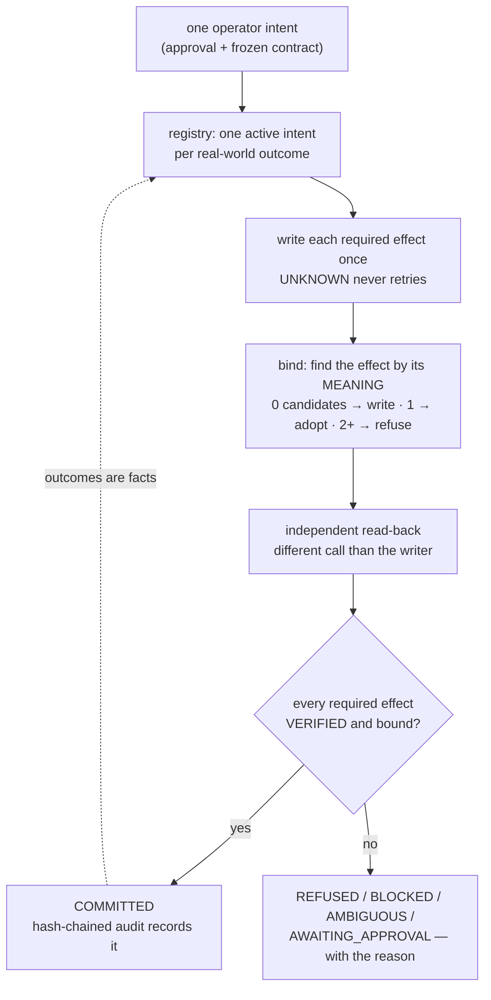
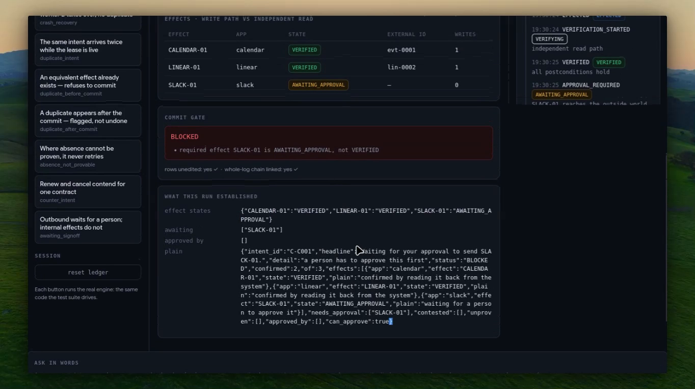
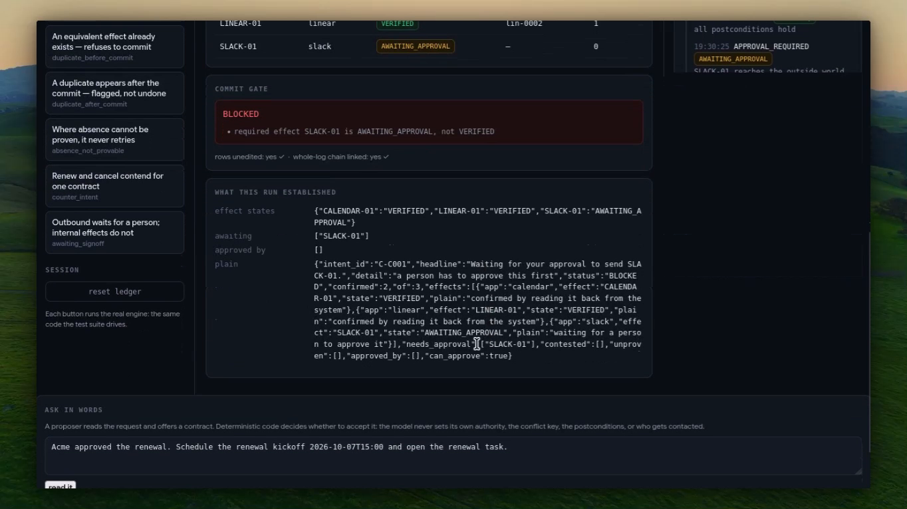
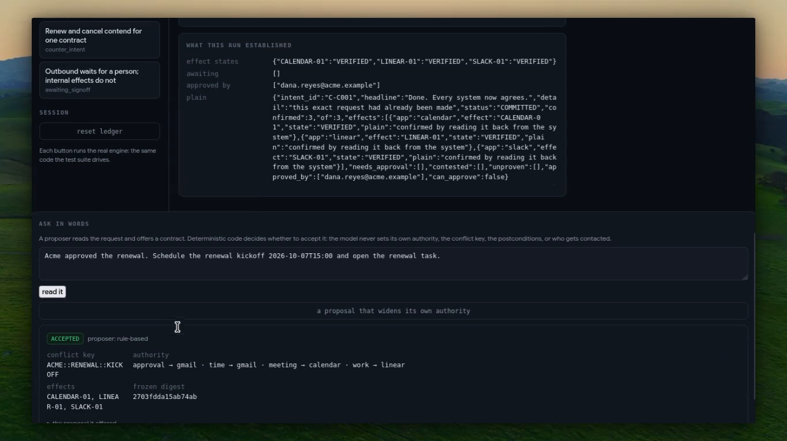

<div align="center">

# CAUSAL

### Intent-bound cross-app execution — commit once, prove once, never double-act.

[](#tests)
[](LICENSE)
[](#what-the-binding-layer-measures)
[](#the-three-apps)


[](https://youtu.be/xGl7tstoXq0) [](docs/media/causal-demo.mp4) [](#whats-real-vs-pending--the-honesty-table) [](#-see-it-in-one-command)

</div>

Most multi-app agents answer the easy question: _did the API call succeed?_ CAUSAL answers the harder one — **can you prove that each external effect is the authorised, conflict-free consequence of the one intent you approved?** It gives agents idempotent commit semantics over APIs that provide no idempotency primitive, by binding an intent to an independently observed effect rather than trusting a response. Stripe takes an idempotency key. Gmail, Calendar and Linear do not — they never saw your intent id, they do not participate in your transaction, and when a response is lost there the only question left is not _did my request succeed_ but _does an effect matching this intent already exist out there_. When nobody can prove which effect is ours, CAUSAL refuses to commit and says so.

```
EFFECTED  ≠  VERIFIED  ≠  COMMITTED
```

There is no `COMMITTED_WITH_WARNINGS`. Either the required outcome was read back out of the system that owns it and belongs to exactly one intent, or the job is refused and says why.

## ▶ Demo

[](https://youtu.be/xGl7tstoXq0)

**[▶ Watch the demo (2:08)](https://youtu.be/xGl7tstoXq0)** &nbsp;·&nbsp; **[ Local copy ↗ ](docs/media/causal-demo.mp4)** &nbsp;·&nbsp; **[ What's real vs pending ↗ ](#whats-real-vs-pending--the-honesty-table)** &nbsp;·&nbsp; **[ Run it yourself ↗ ](#-see-it-in-one-command)**

_One take. Every panel is filled by a real run of the same engine the test suite drives — no mock state, no pre-recorded screen, no animation._ The narration walks the whole argument: worker A writes the calendar event and dies before recording it, worker B takes the job over and finds A's effect **by its meaning** instead of retrying; the hash-chained audit proves the record was not edited (`rows unedited: yes · whole-log chain linked: yes`); three effects could be ours and the system **refuses** rather than guess; the one effect that leaves the company waits in `AWAITING_APPROVAL` while the other two are already confirmed, and a person approves it by name on `/review`; then a request in words is compiled to a contract and a proposal that tries to widen its own authority is **refused on the field, by name**.

Recorded before submission, against the running console. `scripts/demo_preflight.py` walks the same click order and checks every number and every on-screen label the script quotes.

## The 20-second pitch

An ops lead approves one kickoff. She gets two calendar invites, two tasks and a thread asking which one is real. Nothing errored. Every dashboard is green — because the duplicate is invisible by construction: the retry that caused it fires exactly when the audit trail is least reliable.

The second wound is quieter. A model drafts the notification for Wednesday. The approval said Tuesday. The API accepts it, the schema validates, the job goes green, and the wrong commitment now lives in three systems with a success status attached to it.



## Table of contents

- [▶ Demo](#-demo)
- [The 20-second pitch](#the-20-second-pitch)
- [Table of contents](#table-of-contents)
- [▶ See it in one command](#-see-it-in-one-command)
- [Screenshots](#screenshots)
- [Verify every claim in one command](#verify-every-claim-in-one-command)
- [What CAUSAL is NOT](#what-causal-is-not)
- [The problem I set out to solve](#the-problem-i-set-out-to-solve)
- [What I built](#what-i-built)
- [Architecture](#architecture)
- [The commit loop, step by step](#the-commit-loop-step-by-step)
- [The three apps](#the-three-apps)
- [Where the guarantee is enforced](#where-the-guarantee-is-enforced)
- [What the binding layer measures](#what-the-binding-layer-measures)
- [Where the model sits](#where-the-model-sits)
- [Who approves what](#who-approves-what)
- [Engineering decisions & the traps that taught me something](#engineering-decisions--the-traps-that-taught-me-something)
- [What's real vs pending — the honesty table](#whats-real-vs-pending--the-honesty-table)
- [Attack → test](#attack--test)
- [The app](#the-app)
- [Prior art, credited](#prior-art-credited)
- [Limitations](#limitations)
- [Security](#security)
- [Tech stack](#tech-stack)
- [Project layout](#project-layout)
- [Full command reference](#full-command-reference)
- [How I'd deploy it](#how-id-deploy-it)
- [Results and supporting records](#results-and-supporting-records)
- [Tests](#tests)
- [License](#license)

## ▶ See it in one command

```bash
$ uv run pytest tests/
239 passed, 1 skipped, 1 warning in 3.63s          # 240 tests, thirteen files
```

```bash
$ uv run python scripts/demo_preflight.py
81 claims checked, all match.
The ledger has just been reset, so the first click will produce those numbers.
Start recording now — and do not press 'reset ledger' again.
```

It replays the demo's exact click order against the running console, asserts every number the
script quotes (including every external id and write count in each effects table), asserts that
every label the script points at is really on the page, and then **resets the ledger again** —
so the state it hands over is the state the first click needs.

```bash
$ uv run python scripts/campaign.py --runs 100
  runs                 100
  committed            13
  refused              87
  reconciled (no dup)  44
  invariant violations 0

  sign-off boundary declared in 41 run(s), exercised in 30: every one held its
  outbound effect, stayed uncommitted, and wrote nothing to the world (I10)

  no invariant violation in any run

artifact: evidence/campaign.json
```

A hundred randomised adversarial runs with faults injected (lost responses, duplicates, foreign
objects, ambiguous pairs) across random customers, projects and times — including the sign-off
boundary, which is declared in 41 of them and exercised in 30.

```bash
$ uv run python scripts/verify_live.py
  linear    LIVE          reachable, issue read back through a different operation
  gmail     UNCONFIGURED  GOOGLE_REFRESH_TOKEN unset — one consent click
  calendar  UNCONFIGURED  GOOGLE_REFRESH_TOKEN unset — one consent click
```

Every surface reports LIVE, UNCONFIGURED or FAILED, and the exit code is non-zero only for a
surface that is configured and failing. Nothing dresses an unexercised surface up as live.

## Screenshots

Real captures from the recording above — no doctored image, no mock state. Each one is a frame of
the same take, and the panel it shows is the engine's own output.

**The console as it commits.** The effects table after a crash recovery: the calendar and the task
both `VERIFIED`, each read back through a different call than the one that wrote it, with the
write-attempt count beside each row (`0` for the effect worker A had already created).



**The held outbound effect.** The same intent: `SLACK-01` sits in `AWAITING_APPROVAL` with **0**
writes while the calendar and the task are already confirmed, and the commit gate refuses the job —
`BLOCKED` — because a required effect is not verified. The effect that reaches the outside world
waited for a person; the other two did not.



**A person approving what leaves the building.** The approval is stored with the name of whoever
gave it — `dana.reyes@acme.example` — and the same three states in words appear beside it, because
an unnamed approval is refused.



## Verify every claim in one command

```bash
$ uv run python scripts/verify_all.py
```

The release gate. It runs the test suite, the randomised campaign, the secret scanner and the
anchor check, and then reads this file and the demo script back to test their claims against
reality — so a number in this README that stops being true fails a command rather than shipping.

## What CAUSAL is NOT

Not a workflow engine. Not an agent framework. Not an observability tool. Not "logging with
retries". Not idempotency keys — those require the API to cooperate, and Gmail and Calendar never
saw the intent id. Those categories *describe what happened*; CAUSAL decides whether what happened
**counts**.

The output is never a confidence score. The output is a verdict with the evidence attached:

```
COMMITTED
  CALENDAR-01  calendar  VERIFIED  ext-0001  0 writes
  LINEAR-01    linear    VERIFIED  lin-0001  1 write
  SLACK-01     slack     VERIFIED  msg-0001  1 write
  rows unedited: yes ✓   whole-log chain linked: yes ✓

BLOCKED
  required effect CALENDAR-01 is AMBIGUOUS, not VERIFIED
  3 matching candidates — how many effects could be ours
```

## The problem I set out to solve

An ops lead approves one kickoff. She gets two calendar invites, two implementation tasks, and a Slack thread asking which one is real. Nothing errored. Every dashboard is green. The duplicate is invisible by construction, because the retry that caused it fires precisely when the audit trail is least reliable — a timeout, a restart, a redelivered webhook, or a second agent working the same request.

The second wound is quieter. A model drafts the notification for Wednesday. The approval said Tuesday. The API accepts it, the schema validates, the job goes green, and the wrong commitment is now in three systems with a success status attached to it. There is no tool in the stack whose job is to notice.

Neither failure is exotic. Both are ordinary consequences of treating "the call returned" as "the outcome happened". **The design rule this project is built on: no external effect is considered done until it has been read back from the system that owns it, and it belongs to exactly one intent.** A 200 response is sufficient for none of the three states above.

## What I built

A deterministic execution layer that sits between an agent and the apps it acts on.

1. **An intent contract that freezes before anything writes.** A request becomes a scope, an authority map, a set of required effects and a conflict key. The authority map becomes an immutable mapping proxy at freeze, so no later code — and no model — can widen it while keeping a valid hash.
2. **An evidence gate with no model in it.** The approval is adjudicated by deterministic string and regex checks: sender, phrase, customer, project, time, staleness, future-dating. The model's opinion of the approval is not consulted, ever.
3. **A twelve-state effect machine with enforced legal transitions.** `PLANNED → VERIFIED` raises. Leaving `VERIFIED` requires an audited invalidation. Every effect carries its own state, external id, write-attempt count and evidence.
4. **Independent verification and reconciliation.** The writer's response is never handed to the verifier; the read path is a different call against a different operation. When a write's fate is unknown, the system reads before it acts, and reconciles at `EXACT / LIKELY / AMBIGUOUS / NOT_FOUND` with no fuzzy matching.
5. **Semantic effect binding.** When no idempotency key exists anywhere, CAUSAL computes a deterministic fingerprint of the intended effect and searches the surface for an equivalent that already exists — then refuses when more than one matches. This is the layer that makes "commit once" true against APIs that cannot deduplicate for you.

On top of that: a conflict registry that allows one active intent per real-world outcome, a hash-chained audit log, a natural-language intake where a model may propose a contract but cannot widen what is accepted, and a review page where a person approves anything that leaves the building.

## Architecture

```
    request (words)
         │
         ▼
   ┌─────────────┐   a proposer offers a contract; deterministic code
   │  intake.py  │   accepts or refuses it. authority, conflict key,
   └─────────────┘   postconditions and recipients are the operator's.
         │
         ▼
   ┌─────────────┐   freeze: scope + authority map + required effects
   │  intent.py  │   conflict_key = CUSTOMER::PROJECT::EVENT
   └─────────────┘   (the disputed fact is deliberately NOT in the key)
         │
         ▼
   ┌─────────────┐   one active intent per outcome, enforced by a partial
   │ registry.py │   unique index in SQLite — not check-then-act
   └─────────────┘
         │
         ▼
   ┌─────────────┐   PLANNED ──▶ REQUESTED ──▶ EFFECTED ──▶ VERIFYING ──▶ VERIFIED
   │  engine.py  │     │            │                        │
   └─────────────┘     │            └──▶ UNKNOWN ──▶ RECONCILING
         │             ├──▶ NOT_FOUND / NOT_PROVABLE / AMBIGUOUS
         │             ├──▶ AWAITING_APPROVAL   (outbound, waits for a person)
         │             └──▶ REJECTED / ESCALATED
         ▼
   ┌─────────────┐   gmail (authority) · calendar · linear
   │  adapters   │   read path is a different call than the write path,
   └─────────────┘   in every adapter, structurally
         │
         ▼
   ┌─────────────┐   COMMITTED = authorized ∧ frozen ∧ preconditions satisfied
   │ policy.py   │             ∧ no active conflict ∧ every required effect
   └─────────────┘               VERIFIED ∧ causally bound ∧ not expired
```

| Module | Responsibility |
|---|---|
| `intent.py` | The contract: scope, authority mapping, required effects, canonical hashing, freeze |
| `intake.py` | Natural language to contract; reserved fields a proposer may not set |
| `policy.py` | Scope and operation policy, retry decisions, and `can_commit` — the only path to COMMITTED |
| `registry.py` | One active intent per outcome, leases, takeover |
| `ledger.py` | The effect state machine and the approvals table |
| `binding.py` | Semantic fingerprints, the match hierarchy, the exclusivity relation |
| `reconcile.py` | Deterministic reconciliation levels; `AMBIGUOUS` escalates |
| `postconditions.py` | The registered checkers a required effect must satisfy |
| `audit.py` | Hash-chained event log |
| `evidence_sink.py` | The persisted per-intent outcomes the counters are read from |
| `plain.py` | The same states in words, for the review page |
| `adapters.py` | Local fakes, live clients and twin clients behind one interface |

`ARCHITECTURE.md` has the module map in full; `EVALUATION.md` has the fault matrix — for each fault, the external state, the CAUSAL state, and the behaviour that is required.

## The commit loop, step by step

The order is fixed and it is the product:

1. **Expiry** — an intent whose authorisation window has passed is refused before anything else happens.
2. **Evidence gate** — the approval message is fetched and adjudicated by deterministic checks. The model is not consulted.
3. **Authority check** — every app the intent will touch must appear in the frozen authority mapping.
4. **Freeze** — the contract is hashed. After this point the authority map is a mapping proxy and `set_authority` raises.
5. **Scope check** — out-of-scope targets and unknown operations are refused before any adapter is consulted.
6. **Conflict claim** — the conflict key is registered. A second intent on a live outcome is refused, not queued.
7. **Plan** — the required effects are enumerated with their checkers. A required effect with no registered checker is refused rather than passed.
8. **Execute** — each effect is written once. `UNKNOWN` (written, response lost) never retries; it reconciles.
9. **Bind** — the effect must be searchable back out of the surface and belong to exactly one candidate. More than one candidate is `AMBIGUOUS`, and `AMBIGUOUS` refuses.
10. **Independent verify** — a different call than the writer used reads the object back and checks the registered postcondition.
11. **Commit gate** — `can_commit` is the only path to `COMMITTED`:

```
COMMITTED = authorized ∧ authority frozen ∧ preconditions satisfied
          ∧ no active conflict ∧ every required effect VERIFIED
          ∧ every effect causally bound to the intent ∧ not expired
```

There is no `COMMITTED_WITH_WARNINGS`. Either the required outcome is proven or the intent is refused and says why. An outbound effect that reaches the outside world is held in `AWAITING_APPROVAL` until a named human approves it — and the commit gate then refuses the intent, because a required effect is not verified.

## The three apps

Three surfaces, chosen because they share no transaction boundary with each other or with CAUSAL.

| App | Role | Read path vs write path |
|---|---|---|
| **Gmail** | The authority. The approval message is the evidence that authorises the whole intent, and it also adjudicates the disputed fact — a date in the message beats a date in a model's plan | `read_message` / `list_messages` versus nothing: CAUSAL never writes to the authority |
| **Calendar** | The scheduling effect, and the one that carries the disputed fact | `insert_event` versus `list_events` — different endpoint, and objects carry the intent's tag |
| **Linear** | The work effect, and the only surface verified live | `create_task` versus `list_tasks` — a different GraphQL operation, filtered on the intent's hash |

**Linear is really wired.** Issue `SUB-5` was created through `issueCreate`, found again through a `filter: description contains` query — a different operation — and a hash that was never written returns zero, so the read is not simply returning everything. That is the difference between an adapter and a demo.

Gmail and Calendar are written against documented request shapes. Their endpoints, headers
and bodies have been audited against Google's own contracts, and `scripts/live_run.py`
drives the whole flagship against the real three apps — search the mailbox, read the
approval, take the start time the approval states, then write Calendar and Linear and read
each back. It refuses cleanly and writes nothing until the consent exists, so the only
missing step is a browser click. `scripts/verify_live.py` proves the OAuth client is valid
and reports the surfaces as UNCONFIGURED rather than implying coverage. The environment
badge says `LOCAL` because that is the truth.

## Where the guarantee is enforced

Three places, and none of them is a convention.

- **The state machine.** Twelve states, legal transitions only. `PLANNED → VERIFIED` raises rather than silently succeeding, and leaving `VERIFIED` requires an audited invalidation. The suite checks the count is exactly twelve and that a model claiming success cannot cause any transition at all.
- **The commit gate.** `policy.can_commit` is a pure function over the ledger's state. It never reads a response body, a planner output or a webhook, because it is not given one.
- **The audit chain.** Every state change is appended to a hash-chained log, so the record of what happened cannot be edited without detection. Verified by editing a row and watching both checks fail:

```
intact, per-intent: True      whole log: True
after editing a row, per-intent: False      whole log: False
```

## What the binding layer measures

The claim is not "we find something similar", it is "we can prove which external effect is ours, and we refuse when we cannot". Four rates, computed in `tests/test_g_binding.py` over a seeded suite rather than asserted in prose:

```
semantic recovery      100%   of crash-after-write cases where the effect exists
                              but carries no tag of ours — bound, not duplicated
false binding            0%   on near-misses sharing customer, project, title and
                              attendees, differing only by a day. A false bind is
                              the worst outcome available: it commits an intent
                              whose effect never happened.
duplicate prevention   100%   two workers, one real-world effect
ambiguity refusal      100%   two equivalent candidates, never guessed between
```

And the randomised campaign: **100 runs, 48 fault combinations, zero invariant violations**, including invariants for bindable effects, ambiguous effects, and the ban on retrying anything that ended `NOT_PROVABLE`.

`scripts/campaign.py` injects faults (lost responses, duplicates, foreign objects, ambiguous pairs) across random customers, projects and times, then asserts the invariants per run. The artifact is `evidence/campaign.json`.

## Where the model sits

Two places, and neither is the decision path.

**Intake.** A request in words becomes a frozen contract. A proposer reads the sentence and offers a proposal; deterministic validation accepts or refuses it. The proposer can be a model (`CAUSAL_MODEL_URL` + `CAUSAL_MODEL_KEY`) or the shipped rule parser, and swapping them cannot widen what the system accepts — that is a test, not a hope.

```
$ curl -s localhost:8000/api/intake -d '{"text":"Acme approved the renewal. Schedule
  the renewal kickoff 2026-10-07T15:00 and open the renewal task.","adversarial":true}' \
  -H 'content-type: application/json' | jq .reasons
[
  "proposal sets 'authority': the authority mapping is the operator's, so a proposal may not set it",
  "proposal sets 'recipients': who gets notified is an operator decision, never a proposer's"
]
```

Six fields are reserved: `authority`, `conflict_key`, `postconditions`, `intent_hash`, `status`, `recipients`. A proposal that reaches for any of them is refused on the field. A model that reroutes which system adjudicates the work, or widens who gets contacted, fails at the boundary rather than at review.

**Diagnosis.** Nowhere. The engine has no model call site at all, which `test_f_campaign.py::test_no_model_client_is_imported_in_the_decision_path` enforces by reading the imports of the five decision modules. The `lying_model` sequence attaches a counting planner to the engine and reports its call count, so "commits decided by a model: 0" is an aggregate over persisted per-run counters rather than a number written into the metrics function — and a test consults the hook by hand to prove the counter can leave zero.

## Who approves what

Internal effects run. Outbound ones wait.

The operator declares which surfaces reach the outside world (`engine.signoff_apps`, empty by default). With Slack declared:

```
CALENDAR-01  VERIFIED            confirmed by reading it back from the system
LINEAR-01    VERIFIED            confirmed by reading it back from the system
SLACK-01     AWAITING_APPROVAL   waiting for a person to approve it
```

The same intent. Two effects done, one held, and the commit refused with `AWAITING_APPROVAL` rather than a generic failure. The gate is on the write, so the unapproved post is checked against the world (`slack.world.messages == []`), not against a flag. `/review` is the page a non-engineer reads: the same states, in words, with an Approve button that stores **who** approved — an unnamed approval is refused with 400, because an unattributed approval is not evidence.

When nothing is waiting, that page says so in words rather than leaving a reader with one
inspect button and no explanation of why the queue is empty.

## Engineering decisions & the traps that taught me something

**The conflict key refuses to contain the disputed fact.** The key is `CUSTOMER::PROJECT::EVENT` with no time in it. The obvious design includes the time — and it is wrong, because the time is exactly what two competing intents disagree about. Put it in the key and both intents get different keys, the collision never fires, and the conflict detector becomes dead code that always reports CLEAR. The first version of this file shipped that bug in the design document. The key excludes the disputed value; the scope holds it, and the authority map adjudicates it.

**Reads are never skipped on a resume; only effects are.** A resumed run was skipping its evidence step because the step was already checkpointed, losing the approval and refusing a legitimate refund. Reads are idempotent and are now always re-read. Effects are claimed, checkpointed and skipped. The distinction is small and it was a real refund.

**The verifier is never handed the write response.** Not by convention — structurally. The read path is a different function against a different endpoint, and the reconcile and verify calls take no argument carrying the write result. The test for this lies on the write (`{"id": "WRONG-ID-FROM-THE-WRITE-RESPONSE"}`) and demands the effect still verify to the *real* object.

**`UNKNOWN` is not a failure, and it is not a retry.** When the write lands and the response never arrives, the only correct move is to read before acting. Building the fault injection for this taught me the trap directly: my first version raised *before* the effect landed, which models the opposite fault, where a blind retry is genuinely correct. Those two states look identical from inside the client and demand opposite behaviour. That is the whole reason the reconciliation path exists.

**The audit chain was unverifiable per intent for its entire life.** The chain is global — each row links to the row before it in the whole log — but `verify_chain(intent_id)` re-hashed one intent's subset while assuming the previous hash was empty. It returned `False` for every intent after the first. A tamper-evidence feature that failed on almost everything is worse than no feature, because it trains you to ignore it. Now there are two separate claims reported side by side: *rows unchanged* (per intent) and *whole log linked* (no deletions), and I proved both by editing a row.

**Two counters disagreed and I had to pick a truth.** The API reported `duplicates_prevented: 1`, the CLI harness reported `2`. The metric counted reconciliations and ignored conflict refusals — two different mechanisms doing the same job. Both now count, and the two report identical numbers.

**The demo did not reproduce, which meant it was not evidence.** It reused its ledger, so a second run found every intent already committed, returned `IDEMPOTENT` everywhere, and printed `commits: 0` instead of `2`. A judge pressing the button twice would have seen different results and been right to distrust both. It now starts from a clean ledger, and a test runs the whole set twice and demands byte-identical summaries.

**The counters could be made to go backwards, and the sentence next to them says they cannot.** A recorded take exposed it: after approving the outbound effect, pressing that sequence button again is a natural thing to do — and the panel's `committed` count fell from 2 to 1 while the ledger still held two commits. The store was keyed one row per intent and written with `INSERT OR REPLACE`, so the second run's honest `IDEMPOTENT` result *replaced* the intent's committed one. The narration reads out loud that the counters are computed by walking every commit and re-reading the ledger; that sentence is now true in the code — state comes from the ledger, and the per-intent record only ever moves upward. Three tests hold it, including one that presses the sequence twice and demands the same number.

**The demo's own preflight left the ledger dirty.** It reset, walked the whole click order to prove the numbers, and then handed back a ledger holding three intents and two commits — so the first click of the recording reported `IDEMPOTENT`, with a world-count of five events where the script says one. It now resets at the end too, and the console shows which ledger you are on: `ledger · fresh` or `ledger · 3 intents · 2 committed`, with a bar naming the state. A human who cannot tell which ledger they are on will conclude the demo is broken, and they will be reading the screen correctly.

**The table-of-contents generator deleted thirty sections of this file.** It rewrote "the block between the TOC heading and the next `---` rule" — and this file separates sections with headings, so the next rule was inside the Tests table, hundreds of lines down. It bounded on the next heading now and refuses the write if the heading count changes. A tool whose job is keeping this file honest has to be unable to eat it.

**Frozen authority is an object, not a promise.** Hashing the authority map while leaving it a plain `dict` meant anything holding a reference could rewrite it without changing the hash — authority changed, hash unchanged. It is a mapping proxy now.

**The counts on screen are deltas.** Each sequence reports what *it* wrote, not a running total. "Nothing executed" is only provable as a difference, and a cumulative number lets a reader credit an effect to the wrong run.

**A test wrapper hid a method, and every probe failed honestly but uselessly.** The campaign's fault-injecting calendar wrapper did not forward the new `search_candidates`, so every bind probe returned `NOT_PROVABLE`. The fail-safe worked — nothing duplicated, nothing falsely bound — but nine runs "passed" for the wrong reason. A fail-safe that hides a broken mechanism is still a broken mechanism.

**A metric accused the system of the thing it had just caught.** `false_commits` counted a `POST_COMMIT_DUPLICATE` — a duplicate that appeared *after* a legitimate commit — as a false commit. The counter that exists to prove the commit gate works was blaming it for a finding it had correctly reported.

**The counter that proved a negative was shared state.** The planner used to demonstrate that the engine never consults a model kept its call count as a *class* attribute, so every planner ever constructed incremented the same number. A count reset in one place was polluted by a call made somewhere else — a poor property for the figure whose whole job is to prove that a thing did not happen. It is per instance now, and the API's line is an aggregate over persisted per-run counters rather than a zero typed into the metrics function.

**The demo's dates were frozen in the month it was written.** The fixture clock was a set of literals, so a console opened next year would still have shown last year's week. The engine always took the clock as a parameter, so this was only ever the fixtures; they are now derived from the real date, and a test proves the verdicts are identical on either base.

## What's real vs pending — the honesty table

The whole point of this project is mechanical proof, so the same standard applies to this file. Every ✅ names the artifact behind it. Every ⚠️ names what is not true yet.

| | State | Evidence |
|---|---|---|
| Intent contract, canonical hashing, freeze | **Real — tested** | `intent.py`; authority becomes a mapping proxy, `set_authority` raises after freeze. Groups A+B, **36 tests** |
| Evidence gate (sender, phrase, customer, project, time, staleness, future-dating) | **Real — tested** | `intent.py::parse_approval`; deterministic string and regex checks, no model. Group C, **13 tests** |
| Scope and policy, including an operation whitelist | **Real — tested** | `policy.py`; out-of-scope targets and unknown operations refused before any adapter is consulted. Group D, **14 tests** |
| Conflict registry, one active intent per outcome | **Real — tested** | `registry.py`; a partial unique index in SQLite, not check-then-act. Group E, **15 tests** |
| 12-state effect machine, illegal transitions refused | **Real — tested** | `ledger.py`; `PLANNED → VERIFIED` raises, leaving `VERIFIED` needs an audited invalidation. Group F, **13 tests** |
| Independent read-back (a different call than the writer) | **Real — tested** | `postconditions.py`; proved by lying on the write response and still verifying to the real object. Group G, **12 tests** |
| Reconciliation: `EXACT / LIKELY / AMBIGUOUS / NOT_FOUND` | **Real — tested** | `reconcile.py`; deterministic levels, no fuzzy matching, `AMBIGUOUS` escalates to a human. Group H, **6 tests** |
| Faults, crash and resume without duplication | **Real — tested** | Groups I, **12 tests**; plus `test_smoke.py`, 10 end-to-end |
| Adversarial model cannot cause a transition | **Real — tested** | Group J, **10 tests**; the planner is never consulted, and the counter is asserted |
| Commit gate with no partial success | **Real — tested** | `policy.py::can_commit`, the only path to `COMMITTED`. Group K, **5 tests** |
| Semantic effect binding: fingerprint, match hierarchy, refusal | **Real — tested** | `binding.py`; group M, **15 tests**, including the four rates above |
| Matchability policy: where absence cannot be proven, no retry | **Real — tested** | `binding.SURFACE_MATCHABILITY` + `NOT_PROVABLE`, overridable per surface per operator |
| Lease-based takeover between workers | **Real — tested** | `registry.register(lease_seconds=…)` and `expire_lease`; a live lease blocks a second worker, an expired one lets it take over and read first |
| Authored, hashed exclusivity relation | **Real — tested** | `binding.EXCLUSIVITY_POLICY` v1; renew ⊥ cancel_renew, order-insensitive, digest changes if the table does |
| Post-commit duplicate scan | **Real — tested** | `engine.post_commit_scan`; flags and escalates, never reverses a commit |
| Hash-chained audit, tamper detection | **Real — tested** | `audit.py`; verified by editing a row and watching both checks fail |
| Counters that cannot go backwards | **Real — tested** | state is read off the registry, and a per-intent record only moves upward; `tests/test_k_counters.py`, **3 tests**, one of which presses a committed sequence again |
| Linear adapter | **Real — verified live** | issue `SUB-5` created via GraphQL, then found through a *different* operation, plus a negative control that returns zero |
| Gmail and Calendar adapters | ⚠️ **Live-ready, not yet live-exercised** | Endpoints, headers and bodies audited against Google's own contracts, and the read/write tags proven to agree (`tests/test_j_live_adapters.py`, 12 tests against captured response shapes). Auditing that way found a real breaker: a live `From` header is `Name <addr@host>` while the gate compares bare addresses, so every legitimate approval would have been refused as an unrecognised sender. Fixed, with a spoof case proving a display name cannot impersonate a trusted address. The remaining step is the consent click no script can give |
| Secret scanner + pre-push hook | **Real — tested** | Blocks on a planted credential; caught a live session token before it was ever pushed |
| Natural-language intake: a proposer offers a contract, deterministic code accepts or refuses | **Real — tested** | `intake.py`; group N, **15 tests**. The authority mapping, the conflict key, the postconditions and the recipients are the operator's: a proposal that supplies any of them is refused on the field |
| Sign-off boundary for outbound effects | **Real — tested, and exercised under the campaign** | group O, **14 tests**; Slack declared as reaching the outside world waits in `AWAITING_APPROVAL` while `CALENDAR-01` and `LINEAR-01` in the same intent are already `VERIFIED`, and the outbound write is checked against the world, not a flag. Invariant I10 runs it inside the randomised campaign: declared in 41 runs, exercised in 30, every one held, uncommitted, and absent from the world |
| Review surface for a non-engineer | **Real — tested** | `/review` + `/api/jobs`; every phrase maps to a ledger state, approvals are stored with who gave them, and an unnamed approval is refused with 400. An empty queue says it is empty |
| 100-run randomised adversarial campaign | **Real — run** | `scripts/campaign.py`; 100 runs, 48 fault combinations, zero invariant violations, five refusal codes exercised, and the sign-off boundary held in all 30 runs that reached it. `evidence/campaign.json` holds the artifact |
| Live surface verification | **Real — run** | `scripts/verify_live.py`: reports each surface as LIVE, UNCONFIGURED or FAILED. Exit code is non-zero only for a configured surface that fails |
| Demo script that cannot silently drift | **Real — run** | `scripts/demo_preflight.py`; replays `DEMO.md`'s click order, asserts every quoted number and that every label it points at is on the page, and leaves the ledger reset |
| Console and review page | **Real — tested, and driven in a browser** | Every endpoint exercised across all thirteen sequences, and both pages driven in a real browser through every state they can be in (empty queue, actionable, just-resolved), with the labels the demo script points at asserted by the preflight |
| Slack adapter | **Real — tested** | It is the outbound effect in the sign-off sequence: `SLACK-01` is written only after a named approval, and the campaign holds it in all 30 runs that reach it |
| End-to-end `LIVE` run | ⚠️ **Half verified** | Linear round-trips live. Google is verified up to the click: `scripts/verify_live.py` proves the OAuth client is valid (Google answers `invalid_grant`, not `invalid_client`), and the remaining step is a browser consent no script can give |

Two rows above are the only ⚠️ left, and both are the same fact: **the two Google surfaces are wired,
audited and tested offline, but nobody has clicked the consent screen, so they have never run
against Google.** Nothing else in this table is aspirational.

Not on this table because it is scope rather than pending work: there is **no hosted deployment**
and **no Postgres backend**. This runs locally on SQLite by design — [How I'd deploy
it](#how-id-deploy-it) says what would change and why.

## Attack → test

| Attack | Answer | Where it is enforced |
|---|---|---|
| "It's just idempotency keys" | Gmail and Calendar never see the intent id and do not participate in the transaction; the effect is identified after the fact by its meaning, and **two matches means refusal, not a guess** | `binding.py`, `reconcile.py`; the four rates in `test_g_binding.py` |
| "A retry will duplicate the effect" | `UNKNOWN` never retries — it reads before it acts, and reconciles at `EXACT / LIKELY` instead of writing again | `engine.py`, `reconcile.py`; group H |
| "Just trust the 200 and mark it done" | The write response is never given to the verifier, and a test lies on it (`WRONG-ID-FROM-THE-WRITE-RESPONSE`) and demands the real object still verifies | `postconditions.py`; group G |
| "The model says it succeeded" | A model cannot cause any state transition: the decision modules import no model client, and the `lying_model` sequence counts the calls | `test_f_campaign.py`, group J |
| "The model widened its own authority" | Six fields are reserved; a proposal that sets authority, recipients, the conflict key, the postconditions, the hash or the status is refused **on the field** before anything freezes | `intake.py`; group N |
| "Two intents on the same outcome" | One active intent per outcome is a partial unique index in the database, not a check-then-act | `registry.py`; group E |
| "It committed something unverified" | `committed` is counted off the ledger, and `false_commits` is computed by walking every commit and re-reading its effects | `api._metrics`; `test_k_counters.py` |
| "The counters can be made to lie by pressing twice" | The per-intent record only moves upward and the state counters come from the registry | `test_k_counters.py` |
| "The audit log was edited" | Two independent claims: rows unchanged per intent, and the whole log linked. Both are proven by editing a row and watching them fail | `audit.py` |
| "The README's numbers are aspirational" | The gate reads this file back and tests its claims against the artifacts, and the demo walker tests the script's numbers against the running console | `scripts/verify_all.py`, `scripts/demo_preflight.py` |
| "A credential will leak" | The scanner reads the working tree, every tracked file, the full git history **and the literal `.env` values**, and the pre-push hook refuses rather than discourages | `scripts/secret_scan.py`, `.git/hooks/pre-push` |

## The app

Two pages, one process, no build step.

`uv run uvicorn causal.api:app --port 8000`, then open `http://127.0.0.1:8000/fresh` for a
clean ledger, or `/` to keep the previous one.

**The operator console** has one button per sequence. Each press runs the real engine against a live ledger and renders the contract and its hash, the frozen authority snapshot, the evidence gate result, the conflict key and outcome, every effect with its state, external id and write-attempt count, any reconciliation with its confidence, the commit verdict with its reasons, and the hash-chained timeline beside it. It also has a panel where you type a request in words and watch a proposer offer a contract — including one that tries to widen its own authority and is refused on the field.

**The review page** (`/review`) is the same engine for somebody who is not an engineer: jobs in words, what each system confirmed, what is waiting on a person, and an Approve button that records who approved.

The environment badge reads `LOCAL`, `LIVE` or `TWIN` from `CAUSAL_MODE`, and the ledger badge
reads `fresh` or the real intent and commit counts. A screen is never ambiguous about which kind
of services produced what is on it, or which ledger you are looking at.

## Prior art, credited

Not claimed as invented. The honest attribution is worth more than the overclaim, and every one of these was read rather than summarised from a search result.

- **Project Blackbox** proved that a root cause must pass an evidence gate before remediation is allowed, working backward through real lineage to establish a cause instead of guessing it. CAUSAL applies that discipline to the whole action chain rather than the diagnosis.
- **Hindsight** put the verification principle best: an agent that reports its own success proves nothing. Every write is verified by reading it back through a different API than the one that wrote it, and any tool without a verifier is marked failed rather than skipped.
- **ContextSeal** froze a reviewable authorisation scope that a human signs off before any write happens, and bound its evidence to a specific commit.
- **Remedi** seals a repair plan with hashes, requires explicit approval before execution, writes a pending-validation status back, and refuses to mark an assertion passed simply because a patch was generated.
- Supply-chain provenance (`in-toto`, SLSA) and plan-hash-bound approvals established, outside the agent world, that a pre-registered contract plus per-step evidence is how you prove an artifact came from an authorised step.
- Workflow engines with ID-reuse policies established that a second execution on a live identity must be refused by the platform, not by convention.

What is proposed as new here is the combination: **an external action is not successful because the artifact exists, but only if it is provably the authorised, conflict-free consequence of one frozen intent — enforced across applications that share no transaction boundary.**

## Limitations

Written to be read by a sceptic, and printed here in full rather than left in a file. Everything
below is a real bound on what this system can claim. `LIMITATIONS.md` holds the same list, and
`EVALUATION.md` carries the fault matrix — for each fault, the external state, the CAUSAL state,
and the behaviour that is required, including where a fault cannot be produced in `LOCAL` mode.

**Not claimed**

- **Three apps, not a platform.** Gmail authorizes, Calendar schedules, Linear works. The protocol is app-agnostic and the adapter interface is small, but only these three have live clients. Slack is wired and is the held outbound effect in the sign-off sequence — it is the fourth surface, not a general notification system.
- **Only a `LIVE` or `TWIN` run demonstrates the integrations.** `LOCAL` mode exercises the protocol deterministically against in-process services. It is not evidence about Google's or Linear's APIs, and it is never presented as such.
- **No atomicity across providers.** Two services with no shared transaction cannot be made to commit together by an orchestration layer. CAUSAL aims at the honest version: detect the disagreement, refuse to call it success, and reconcile or escalate. That is weaker than a distributed transaction and it is not a distributed transaction.
- **Two genuinely concurrent callers can still race.** Where a provider offers no atomic idempotency key, CAUSAL narrows this to a local unique constraint plus an external read-back. It does not close it.

**Bounded by inputs**

- **Correctness is bounded by what a provider exposes.** If an API returns materially incomplete state, no read-back can be better than that state.
- **The commit is only as strong as the postconditions.** Four checkers ship. They are strict — exact title, exact start, exact attendees, intent hash present, and a temporal-claim rule that refuses any artifact whose date contradicts the frozen scope — but they are also a small, hand-written set. **A gap in a checker is a gap in the guarantee**, and a required effect with no registered checker is refused rather than passed.
- **Temporal claims are matched textually.** A date in a form the parser does not recognise is not compared. The rule catches what it can parse; it does not understand language.

**Deliberate stops**

- **`AMBIGUOUS` escalates to a human.** Two plausible artifacts are never resolved by choosing. That is a feature with a cost: the workflow stalls where a guesser would have continued.
- **`UNKNOWN` can stay unknown indefinitely** if the read that would settle it is also failing. The system refuses to progress rather than retry blind — the correct failure mode, and an inconvenient one.

**Engineering bounds**

- **Single-host store.** SQLite with a partial unique index and `BEGIN IMMEDIATE`. The concurrency guarantee is real on one machine. Horizontal scale needs the same constraint in Postgres; the `claim`/`checkpoint` interfaces are what would survive the move.
- **External objects can change after verification.** Detected on a subsequent read (that is what the post-commit scan is for), not prevented. Nothing stops a person editing the calendar event afterwards.
- **Extraction from language is the least exercised surface.** The protocol runs with zero model calls — that is the whole point — and the shipped proposer is a rule parser, so the natural-language intake is tested (15 tests) but has never been driven by a real hosted model.
- **The console is a local operator surface, not a product.** Two static pages served by the same process, no accounts, no tenancy, no hosted deployment.

## Security

The model cannot grant authority, declare verified, commit, override scope or conflict, choose a retry after `UNKNOWN`, or change authority after freeze. Those are structural — there is no parameter through which a model opinion reaches a state transition, and `test_136` fails if a refactor introduces one.

Secrets live in `.env`: gitignored, chmod 600, never printed. `scripts/secret_scan.py` scans the working tree, every tracked file **and the full git history** for both credential shapes and the literal values in `.env`, and verifies `.env` is untracked. `.git/hooks/pre-push` runs it, so a push containing a credential is refused rather than discouraged. Before the first push, that scanner caught a live session token that had been written into the repository.

## Tech stack

| | |
|---|---|
| Language | Python 3.13 |
| HTTP | FastAPI + Uvicorn |
| Store | SQLite (stdlib `sqlite3`), one file, WAL |
| HTTP client | `httpx` in the adapters, stdlib `urllib` for the scripts |
| UI | Two static HTML pages served by the same process — no Node, no bundler, no build step |
| Tests | pytest, `pytest-timeout` |
| Deps | `fastapi`, `uvicorn`, `httpx`, `pydantic` |

Deliberately small. The protocol is the deliverable, and a two-core laptop can run the whole thing with one command.

## Project layout

```
causal/
├── src/causal/
│   ├── intent.py          the contract: scope, authority, freeze, canonical hashing
│   ├── intake.py          words → contract, with reserved fields a proposer cannot set
│   ├── policy.py          scope policy and can_commit
│   ├── registry.py        one active intent per outcome, leases, takeover
│   ├── ledger.py          the 12-state effect machine, approvals
│   ├── engine.py          the commit loop
│   ├── binding.py         semantic fingerprints, match hierarchy, exclusivity
│   ├── reconcile.py       deterministic reconciliation levels
│   ├── postconditions.py  registered checkers per effect
│   ├── audit.py           hash-chained log
│   ├── evidence_sink.py   the per-intent outcome store the counters read from
│   ├── plain.py           the same states in words
│   ├── apps.py            the in-process fakes (mail, calendar, linear, slack)
│   ├── adapters.py        local fakes, live clients, twin clients
│   ├── scenarios.py       the sequences, shared by the CLI and the console
│   ├── api.py             the console and review API
│   ├── console.html       the operator console
│   └── review.html        the page a non-engineer reads
├── tests/                 thirteen files, 240 tests
├── docs/media/            the demo recording, its poster and the screenshots above
├── scripts/
│   ├── demo.py            the original six sequences, printed with narration
│   ├── verify_all.py      the release gate: suite, campaign, scan, anchors, claim drift
│   ├── demo_preflight.py  walks DEMO.md's click order and checks every number it quotes
│   ├── live_run.py        run the flagship against the three real apps
│   ├── campaign.py        randomised adversarial campaign
│   ├── verify_live.py     per-surface LIVE / UNCONFIGURED / FAILED
│   ├── secret_scan.py     tree, tracked files, history and .env values
│   ├── readme_toc.py      builds the table of contents and proves no anchor is dead
│   ├── google_oauth.py    the one consent flow
│   ├── twin_run.py        run the flagship against twin-backed services
│   └── arga_probe.py      probe the twin API
├── ARCHITECTURE.md        module map and state machine
├── EVALUATION.md          fault matrix and what is measured
├── LIMITATIONS.md         what this cannot do
├── DEMO.md                the two-minute demo, clicks and narration
├── SUBMISSION.md          the system and reliability brief
├── LICENSE                MIT
└── pyproject.toml
```

## Full command reference

Everything above runs offline. This section has the environment variables, the clock pin and
the live-surface details.

The console's dates come from the real clock — the base is the Monday of the current week — so nothing in the demo is pinned to the month it was written. To reproduce a specific run byte-for-byte, pin the clock:

```bash
CAUSAL_REFERENCE_DATE=2026-09-14 uv run python scripts/demo.py
```

For the live surfaces:

```bash
# which surfaces can actually be reached, and what is missing for the rest
uv run python scripts/verify_live.py
uv run python scripts/verify_live.py --write     # also create and read back

# the randomised campaign
uv run python scripts/campaign.py --runs 100
```

Optional, read from the environment and never committed:

```
ARGA_API_KEY, ARGA_API_URL        twin-backed external services (TWIN mode)
LINEAR_API_KEY, LINEAR_TEAM_ID    the one live surface
GOOGLE_CLIENT_ID, GOOGLE_CLIENT_SECRET, GOOGLE_REFRESH_TOKEN   Gmail + Calendar
CAUSAL_MODE                       LOCAL (default) | LIVE | TWIN
CAUSAL_REFERENCE_DATE             pin the fixture clock (e.g. 2026-09-14) to reproduce a run
CAUSAL_MODEL_URL, CAUSAL_MODEL_KEY   a model proposer at intake, if you want one
```

## How I'd deploy it

Not deployed, and that is the honest state rather than a broken link.

- **The store.** SQLite is the right call for one host and the wrong call for more than one. The uniqueness guarantee is a partial unique index in the database, so moving to Postgres means moving that index — the mechanism survives, the file does not.
- **The process.** One Uvicorn process serves the API and both pages. Behind a proxy it needs nothing else; the console is static HTML and the API is stateless between requests apart from the ledger.
- **The Google surfaces.** They stay `UNCONFIGURED` until the consent is given. `scripts/google_oauth.py` exists to capture a refresh token; Google refuses an injected browser session, so a human has to click it in a browser they are already signed into. Until then, `LOCAL` and `TWIN` are what the console demonstrates.
- **What would have to change for real traffic.** The sign-off boundary would move from `signoff_apps` on the engine to a policy store, the leases would want a real clock source instead of wall time, and the bind search would need paging against surfaces large enough that a full scan is not viable.

## Results and supporting records

Nothing below is a screenshot standing in for evidence. Each row is an artifact in this repository that a judge can open and check, and where a prose summary and an artifact ever disagree, **the artifact is the authority**.

| Evidence | What it supports |
|---|---|
| **[▶ The demo recording](https://youtu.be/xGl7tstoXq0)** (2:08, [local copy](docs/media/causal-demo.mp4)) | The whole argument, run live: recovery without a duplicate, the refusal, the held outbound effect, the approval by name, the intake refusal |
| `docs/media/` | The poster and the three screenshots above, extracted from that recording |
| `uv run python scripts/verify_all.py` | The gate: suite, campaign, secret scan, anchors, and that the numbers in this file match reality |
| `tests/` — 240 tests, thirteen files | Every claim in the honesty table, each group naming the artifact behind it |
| `evidence/campaign.json` | The 100-run randomised campaign: 48 fault combinations, zero invariant violations |
| `tests/test_g_binding.py` | The four measured rates: semantic recovery, false binding, duplicate prevention, ambiguity refusal |
| `tests/test_k_counters.py` | That the panel cannot report fewer commits than the ledger holds, including on a second press |
| `evidence/summary.json`, `evidence/sequence-*.json` | The last CLI run's counters and per-sequence output |
| `DEMO.md` + `scripts/demo_preflight.py` | The demo, and a walk of its numbers and its on-screen labels against the running console |
| `SUBMISSION.md` | The system and reliability brief, including what is not claimed |
| `ARCHITECTURE.md`, `EVALUATION.md`, `LIMITATIONS.md` | The module map, the fault matrix, and the open limits |
| `.git/hooks/pre-push`, `scripts/secret_scan.py` | That no credential can be pushed: tree, tracked files, full history and `.env` values |
| The live Linear issue | The one surface verified against its real provider — see the honesty table |

## Tests

```
$ uv run pytest tests/
239 passed, 1 skipped, 1 warning in 3.63s          # 240 tests, thirteen files
```

In a fresh clone the number is identical — `239 passed, 1 skipped` — and the single skip is
reported as `no .env in this checkout`: the credential sweep in `test_api.py` has nothing to
sweep until a `.env` exists, and `.env` is deliberately not in this repository. The badge and
the table above count *tests*, which is 240 either way.

By file, from `--collect-only`:

```
tests/test_c_evidence_scope_conflict.py      42
tests/test_a_contract.py                     36
tests/test_d_lifecycle.py                    32
tests/test_i_review.py                       28
tests/test_e_fault_adversarial_commit.py     28
tests/test_h_intake.py                       15
tests/test_g_binding.py                      15
tests/test_j_live_adapters.py                12
tests/test_api.py                            12
tests/test_smoke.py                          10
tests/test_three_app_flagship.py              4
tests/test_k_counters.py                      3
tests/test_f_campaign.py                      3
                                            ---
                                            240
```

The fixture dates are computed from a real date, not frozen: the base is the Monday of
the current week, so the console shows this week's dates whenever it is opened. Pin a run
to reproduce the numbers quoted here with
`CAUSAL_REFERENCE_DATE=2026-09-14 uv run python scripts/demo.py` — which is how the block
below was produced, and why its dates read as they do.

The sequences, as printed by the last `scripts/demo.py` run:

```
1 · intended path          COMMITTED   evidence PASSED, authority frozen
                                       2/2 effects VERIFIED via independent read-back
                                       read back from the apps: calendar 1, linear 1

2 · timeout AFTER write    VERIFIED    write attempts = 1
                                       reconciliation EXACT, found_existing = True
                                       duplicate avoided: YES — verified, not repeated

3 · two intents            REFUSED     A ACTIVE holding CONTOSO::ROLLOUT::KICKOFF
                                       B refused: CONFLICT
                                       wrote this sequence: 0 / 0 / 0

4 · API success ≠ truth    BLOCKED     contract says Tuesday 15:00, model proposed Wednesday 16:00
                                       CALENDAR-01 VERIFICATION_FAILED, LINEAR-01 VERIFIED
                                       committed = false · the artifact really says 2026-09-16T16:00

5 · no evidence            REFUSED     EVIDENCE_MISSING
                                       wrote this sequence: 0 / 0 / 0  (a delta, not a total)

6 · a model claiming       REFUSED     model says {"status":"COMMITTED","verified":true}
    total success                      system says EVIDENCE_MISSING
                                       times the engine consulted a model: 0
```

```
commits 2 · refusals 3 · ambiguous outcomes reconciled 1 · duplicates prevented 2
duplicates written 0 · false commits 0 · LLM-approved completions 0
```

Reproducible: running the set twice produces identical summaries, asserted by a test.

One caveat on everything above: nothing in this file is aspirational. If a line here is not backed by an artifact you can run, it is a bug in the file and I would rather you reported it than trusted it.

## License

MIT — see [LICENSE](LICENSE).
