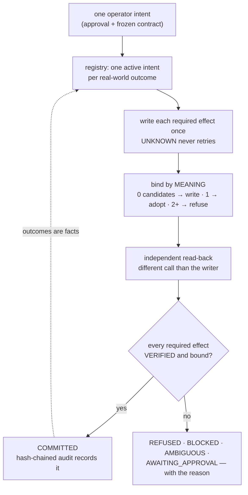

<div align="center">

# CAUSAL

### Intent-bound cross-app execution — commit once, prove once, never double-act.

[](#tests)
[](#the-three-apps)
[](#what-the-binding-layer-measures)
[](LICENSE)


[](https://youtu.be/xGl7tstoXq0) [](docs/media/causal-demo.mp4) [](#whats-real-vs-pending--the-honesty-table) [](#-see-it-in-one-command)

</div>

Most multi-app agents answer the easy question: _did the API call succeed?_ CAUSAL answers the harder one — **can you prove each external effect is the authorised, conflict-free consequence of the one intent you approved?** It gives agents idempotent commit semantics over APIs with no idempotency primitive, by binding an intent to an independently observed effect instead of trusting a response. Stripe takes an idempotency key. Gmail, Calendar and Linear do not — they never saw your intent id, they do not participate in your transaction, and when a response is lost the only question left is not _did my request succeed_ but _does an effect matching this intent already exist out there_. When nobody can prove which effect is ours, CAUSAL refuses to commit and says so.

```
EFFECTED  ≠  VERIFIED  ≠  COMMITTED
```

There is no `COMMITTED_WITH_WARNINGS`. Either the required outcome was read back out of the system that owns it and belongs to exactly one intent, or the job is refused and says why.

## ▶ Demo

[](https://youtu.be/xGl7tstoXq0)

**[▶ Watch the demo (2:08)](https://youtu.be/xGl7tstoXq0)** &nbsp;·&nbsp; **[ Local copy ↗ ](docs/media/causal-demo.mp4)** &nbsp;·&nbsp; **[ What's real vs pending ↗ ](#whats-real-vs-pending--the-honesty-table)** &nbsp;·&nbsp; **[ Run it yourself ↗ ](#-see-it-in-one-command)**

_One take. Every panel is filled by a real run of the same engine the test suite drives — no mock state, no pre-recorded screen, no animation._ The narration walks the whole argument: worker A writes the calendar event and dies before recording it, worker B takes over and finds A's effect **by its meaning** instead of retrying; the hash-chained audit proves the record was not edited (`rows unedited: yes · whole-log chain linked: yes`); three effects could be ours and the system **refuses** rather than guess; the effect that leaves the company waits in `AWAITING_APPROVAL` while the other two are already confirmed, and a person approves it by name on `/review`; then a request in words compiles to a contract and a proposal that tries to widen its own authority is **refused on the field, by name**.

## The 20-second pitch

An ops lead approves one kickoff. She gets two calendar invites, two tasks and a thread asking which one is real. Nothing errored, every dashboard is green — the duplicate is invisible by construction, because the retry that caused it fires exactly when the audit trail is least reliable.

The second wound is quieter. A model drafts the notification for Wednesday. The approval said Tuesday. The API accepts it, the schema validates, the job goes green, and the wrong commitment now lives in three systems with a success status attached. Nothing in the stack is looking for that.



## Table of contents

- [▶ Demo](#-demo)
- [The 20-second pitch](#the-20-second-pitch)
- [Table of contents](#table-of-contents)
- [▶ See it in one command](#-see-it-in-one-command)
- [Screenshots](#screenshots)
- [Verify every claim in one command](#verify-every-claim-in-one-command)
- [What CAUSAL is NOT](#what-causal-is-not)
- [The problem I set out to solve](#the-problem-i-set-out-to-solve)
- [What I built](#what-i-built)
- [Architecture](#architecture)
- [The commit loop, step by step](#the-commit-loop-step-by-step)
- [The three apps](#the-three-apps)
- [Where the guarantee is enforced](#where-the-guarantee-is-enforced)
- [What the binding layer measures](#what-the-binding-layer-measures)
- [Where the model sits](#where-the-model-sits)
- [Who approves what](#who-approves-what)
- [Engineering decisions & the traps that taught me something](#engineering-decisions--the-traps-that-taught-me-something)
- [What's real vs pending — the honesty table](#whats-real-vs-pending--the-honesty-table)
- [Attack → test](#attack--test)
- [The app](#the-app)
- [Prior art, credited](#prior-art-credited)
- [Limitations](#limitations)
- [Security](#security)
- [Tech stack](#tech-stack)
- [Project layout](#project-layout)
- [Full command reference](#full-command-reference)
- [How I'd deploy it](#how-id-deploy-it)
- [Results and supporting records](#results-and-supporting-records)
- [Tests](#tests)
- [License](#license)

## ▶ See it in one command

```bash
$ uv run pytest tests/
239 passed, 1 skipped, 1 warning in 3.63s          # 240 tests, thirteen files
```

```bash
$ uv run python scripts/demo_preflight.py
81 claims checked, all match.
The ledger has just been reset, so the first click will produce those numbers.
Start recording now — and do not press 'reset ledger' again.
```

```bash
$ uv run python scripts/campaign.py --runs 100
  runs                 100
  committed            13
  refused              87
  reconciled (no dup)  44
  invariant violations 0

  sign-off boundary declared in 41 run(s), exercised in 30: every one held its
  outbound effect, stayed uncommitted, and wrote nothing to the world (I10)

  no invariant violation in any run
```

```bash
$ uv run python scripts/verify_live.py --write
  linear       LIVE   wrote SUB-7 and read it back independently
  gmail        LIVE   read path ok (5 recent message(s))
  calendar     LIVE   wrote 5f5fvvs7qjk5cnj3h7brgpnte4 and read it back independently
  google-oauth LIVE   credentials accepted by Google and a refresh token is present

  4 live, 0 unconfigured, 0 failed
```

Four gates, not four screenshots. The preflight asserts the demo's numbers *and* that every
label it points at is on the page, then resets the ledger it walked; the campaign injects faults
into randomised runs; `--write` means a real create and a read-back by id, so `LIVE` is a round
trip that happened rather than a credential that exists.

## Screenshots

Real frames of the recording above, each captioned from what is actually on it.

**The console as it commits.** The effects table after a crash recovery: calendar and task both `VERIFIED`, each read back through a different call than the one that wrote it, with the write-attempt count beside each row (`0` for the effect worker A had already created).


**The held outbound effect.** `SLACK-01` sits in `AWAITING_APPROVAL` with **0** writes while the other two are confirmed, and the commit gate refuses the job — `BLOCKED` — because a required effect is not verified.


**A person approving what leaves the building.** The approval is stored with the name of whoever gave it — `dana.reyes@acme.example` — because an unnamed approval is refused.


## Verify every claim in one command

```bash
$ uv run python scripts/verify_all.py
```

The release gate: suite, campaign, secret scan, anchors — then it reads this file back and tests
its claims against reality, so a number here that stops being true fails a command. Its rows are
printed in [Results](#results-and-supporting-records) and in the run above.

## What CAUSAL is NOT

Not a workflow engine, an agent framework, an observability tool, or "logging with retries". Not idempotency keys — those need the API to cooperate, and Gmail and Calendar never saw the intent id. Those categories *describe what happened*; CAUSAL decides whether what happened **counts**. The output is never a confidence score, it is a verdict with its evidence:

```
COMMITTED                                  BLOCKED
  CALENDAR-01  calendar  VERIFIED  ext-0001  required effect CALENDAR-01 is AMBIGUOUS, not VERIFIED
  LINEAR-01    linear    VERIFIED  lin-0001  3 matching candidates — how many effects could be ours
  SLACK-01     slack     VERIFIED  msg-0001
  rows unedited: yes ✓  whole-log chain linked: yes ✓
```

## The problem I set out to solve

An ops lead approves one kickoff. She gets two calendar invites, two implementation tasks and a Slack thread asking which one is real. Nothing errored. Every dashboard is green. The duplicate is invisible by construction, because the retry that caused it fires precisely when the audit trail is least reliable — a timeout, a restart, a redelivered webhook, or a second agent working the same request.

The second wound is quieter. A model drafts the notification for Wednesday. The approval said Tuesday. The API accepts it, the schema validates, the job goes green, and the wrong commitment is now in three systems with a success status attached. No tool in the stack has the job of noticing.

Both are ordinary consequences of treating "the call returned" as "the outcome happened". **The rule this project is built on: no external effect counts until it has been read back from the system that owns it, and it belongs to exactly one intent.** A 200 is sufficient for none of it.

## What I built

A deterministic execution layer between an agent and the apps it acts on. Five mechanisms, and
the rest of this file is what they cost:

1. **An intent contract that freezes before anything writes.** Scope, authority map, required effects and a conflict key; the authority map becomes a mapping proxy at freeze, so no later code — and no model — can widen it and keep a valid hash.
2. **An evidence gate with no model in it.** Sender, phrase, customer, project, time, staleness and future-dating decided by deterministic string and regex checks.
3. **A twelve-state effect machine with enforced transitions.** `PLANNED → VERIFIED` raises; leaving `VERIFIED` needs an audited invalidation. Every effect carries its own state, external id, write-attempt count and evidence.
4. **Independent verification and reconciliation.** The writer's response never reaches the verifier; the read is a different call against a different operation, and an unknown write is reconciled at `EXACT / LIKELY / AMBIGUOUS / NOT_FOUND` with no fuzzy matching.
5. **Semantic effect binding.** When no idempotency key exists, CAUSAL fingerprints the intended effect, searches for an equivalent that already exists, and refuses when more than one matches — the layer that makes "commit once" true against APIs that cannot deduplicate for you.

On top of those: a conflict registry allowing one active intent per real-world outcome, a
hash-chained audit log, natural-language intake where a model may propose but never widen what is
accepted, and a review page where a person approves anything that leaves the building.

## Architecture

```
    request (words)
         │
         ▼
   ┌─────────────┐   a proposer offers a contract; deterministic code accepts or
   │  intake.py  │   refuses it. authority, conflict key, postconditions and
   └─────────────┘   recipients belong to the operator, never the proposer.
         │
         ▼
   ┌─────────────┐   freeze: scope + authority map + required effects
   │  intent.py  │   conflict_key = CUSTOMER::PROJECT::EVENT
   └─────────────┘   (the disputed fact is deliberately NOT in the key)
         │
         ▼
   ┌─────────────┐   one active intent per outcome, enforced by a partial
   │ registry.py │   unique index in SQLite — not check-then-act
   └─────────────┘
         │
         ▼
   ┌─────────────┐   PLANNED ─▶ REQUESTED ─▶ EFFECTED ─▶ VERIFYING ─▶ VERIFIED
   │  engine.py  │     │            │                       │
   └─────────────┘     │            └──▶ UNKNOWN ──▶ RECONCILING
         │             ├──▶ NOT_FOUND / NOT_PROVABLE / AMBIGUOUS
         │             ├──▶ AWAITING_APPROVAL   (outbound, waits for a person)
         │             └──▶ REJECTED / ESCALATED
         ▼
   ┌─────────────┐   gmail (authority) · calendar · linear · slack
   │  adapters   │   read path is a different call than the write path,
   └─────────────┘   in every adapter, structurally
         │
         ▼
   ┌─────────────┐   COMMITTED = authorized ∧ frozen ∧ preconditions satisfied
   │ policy.py   │             ∧ no active conflict ∧ every required effect VERIFIED
   └─────────────┘             ∧ bound to the intent ∧ not expired
```

| Module | Responsibility |
|---|---|
| `intent.py` `intake.py` | The contract, canonical hashing, freeze; words → contract with reserved fields |
| `policy.py` `registry.py` `ledger.py` | `can_commit` (the only path to COMMITTED), one active intent per outcome, the 12-state effect machine |
| `binding.py` `reconcile.py` `postconditions.py` | Semantic fingerprints and the match hierarchy; deterministic reconciliation; registered checkers |
| `audit.py` `evidence_sink.py` `plain.py` | Hash-chained log; per-intent outcomes the counters read; the same states in words |
| `adapters.py` `scenarios.py` `api.py` | Local fakes, live clients, twin clients; the sequences; the console and review API |

`ARCHITECTURE.md` has the module map in full; `EVALUATION.md` has the fault matrix — for each fault, the external state, the CAUSAL state, and the behaviour that is required.

## The commit loop, step by step

The order is fixed and it is the product:

1. **Expiry** — an intent whose authorisation window has passed is refused first.
2. **Evidence gate** — the approval is adjudicated by deterministic string and regex checks: sender, phrase, customer, project, time, staleness, future-dating. No model is consulted.
3. **Authority check** — every app the intent will touch must appear in the frozen authority mapping.
4. **Freeze** — the contract is hashed; after this the authority map is a mapping proxy and `set_authority` raises.
5. **Scope check** — out-of-scope targets and unknown operations are refused before any adapter is consulted.
6. **Conflict claim** — the conflict key is registered; a second intent on a live outcome is refused, not queued.
7. **Plan** — the required effects are enumerated with their checkers. A required effect with no registered checker is refused rather than passed.
8. **Execute** — each effect is written once. `UNKNOWN` (written, response lost) never retries; it reconciles.
9. **Bind** — the effect must be searchable back out of the surface and match exactly one candidate. More than one is `AMBIGUOUS`, and `AMBIGUOUS` refuses.
10. **Independent verify** — a different call than the writer used reads the object back and checks the registered postcondition.
11. **Commit gate** — `can_commit` is the only path to `COMMITTED`:

```
COMMITTED = authorized ∧ authority frozen ∧ preconditions satisfied
          ∧ no active conflict ∧ every required effect VERIFIED
          ∧ every effect causally bound to the intent ∧ not expired
```

There is no `COMMITTED_WITH_WARNINGS`. An outbound effect is held in `AWAITING_APPROVAL` until a named human approves it — and the commit gate then refuses the intent, because a required effect is not verified.

## The three apps

Three surfaces, chosen because they share no transaction boundary with each other or with CAUSAL.

| App | Role | Read path vs write path |
|---|---|---|
| **Gmail** | The authority: the approval message authorises the whole intent, and adjudicates the disputed fact — a date in the message beats a date in a model's plan | `read_message` / `list_messages` versus nothing: CAUSAL never writes to the authority |
| **Calendar** | The scheduling effect, and the one carrying the disputed fact | `insert_event` versus `list_events` — different endpoint, objects carry the intent's tag |
| **Linear** | The work effect | `create_task` versus `list_tasks` — a different GraphQL operation, filtered on the intent's hash |

**All four surfaces are verified live**, not wired-and-waiting: a real Gmail profile and messages, a real Calendar event created and read back by id, Linear issue `SUB-7` created and found again through a *different* operation, and the OAuth client accepted. Better still, `scripts/live_run.py` drove the **whole flagship against the real three apps** — searched the mailbox, read the approval, built the contract from the message, created a real Calendar event (`qmqcrcai5ihdhs0t4uu5rhp9i8`) and a real Linear issue (`SUB-8`), read each back, and returned **COMMITTED** with the audit chain intact. It writes nothing until the evidence exists: on a mailbox with no approval it prints `0 candidate(s) by search` and stops. The console's badge reads `LOCAL`, `LIVE` or `TWIN` and is never ambiguous about which kind of services produced what is on screen.

## Where the guarantee is enforced

Three places, none of them a convention.

- **The state machine.** Twelve states, legal transitions only. `PLANNED → VERIFIED` raises rather than silently succeeding, and leaving `VERIFIED` requires an audited invalidation. The suite asserts the count is exactly twelve and that a model claiming success causes no transition at all.
- **The commit gate.** `policy.can_commit` is a pure function over the ledger's state. It never reads a response body, a planner output or a webhook, because it is not given one.
- **The audit chain.** Every state change is appended to a hash-chained log; verified by editing a row and watching both claims fail:

```
intact, per-intent: True      whole log: True
after editing a row, per-intent: False      whole log: False
```

## What the binding layer measures

The claim is not "we find something similar", it is "we can prove which external effect is ours, and refuse when we cannot". Four rates, computed in `tests/test_g_binding.py` over a seeded suite rather than asserted in prose:

```
semantic recovery      100%   crash-after-write where the effect exists but carries no tag of
                              ours — bound, not duplicated
false binding            0%   on near-misses sharing customer, project, title and attendees,
                              differing only by a day. A false bind is the worst outcome
                              available: it commits an intent whose effect never happened.
duplicate prevention   100%   two workers, one real-world effect
ambiguity refusal      100%   two equivalent candidates, never guessed between
```

And the randomised campaign: **100 runs, 48 fault combinations, zero invariant violations**, including invariants for bindable and ambiguous effects, the ban on retrying anything that ended `NOT_PROVABLE`, and the sign-off boundary (`I10`). `scripts/campaign.py` injects the faults; `evidence/campaign.json` holds the artifact.

## Where the model sits

Two places, neither in the decision path.

**Intake.** A request in words becomes a frozen contract. A proposer offers a proposal; deterministic validation accepts or refuses it. The proposer may be a model (`CAUSAL_MODEL_URL` + `CAUSAL_MODEL_KEY`) or the shipped rule parser, and swapping them cannot widen what is accepted — that is a test, not a hope.

```
$ curl -s localhost:8000/api/intake -H 'content-type: application/json' -d \
  '{"text":"Acme approved the renewal. Schedule the renewal kickoff 2026-10-07T15:00.","adversarial":true}' \
  | jq .reasons
[
  "proposal sets 'authority': the authority mapping is the operator's, so a proposal may not set it",
  "proposal sets 'recipients': who gets notified is an operator decision, never a proposer's"
]
```

Six fields are reserved: `authority`, `conflict_key`, `postconditions`, `intent_hash`, `status`, `recipients`. A proposal reaching for any of them is refused on the field.

**Diagnosis.** Nowhere. The engine has no model call site at all, enforced by `test_f_campaign.py::test_no_model_client_is_imported_in_the_decision_path` reading the imports of the five decision modules. The `lying_model` sequence attaches a counting planner, so "commits decided by a model: 0" is an aggregate over persisted counters rather than a zero typed into the metrics function — and a test consults the hook by hand to prove the counter can leave zero.

## Who approves what

Internal effects run. Outbound ones wait. The operator declares which surfaces reach the outside world (`engine.signoff_apps`, empty by default) — with Slack declared:

```
CALENDAR-01  VERIFIED            confirmed by reading it back from the system
LINEAR-01    VERIFIED            confirmed by reading it back from the system
SLACK-01     AWAITING_APPROVAL   waiting for a person to approve it
```

Same intent, two effects done, one held, commit refused with `AWAITING_APPROVAL` rather than a generic failure. The gate is on the write, so the unapproved post is checked against the world (`slack.world.messages == []`), not a flag. `/review` is the page a non-engineer reads: the same states in words, with one Approve button that stores **who** approved — an unnamed approval is refused with 400, because an unattributed approval is not evidence. When nothing is waiting, that page says so.

## Engineering decisions & the traps that taught me something

**The conflict key refuses to contain the disputed fact.** `CUSTOMER::PROJECT::EVENT`, no time. The obvious design includes the time — and it is wrong, because the time is exactly what two competing intents disagree about. Put it in the key and both get different keys, the collision never fires, and the detector becomes dead code that always reports CLEAR. The scope holds the disputed value; the authority map adjudicates it.

**`UNKNOWN` is not a failure and it is not a retry.** When the write lands and the response never arrives, the only correct move is to read before acting. My first fault injection raised *before* the effect landed — the opposite fault, where a blind retry is genuinely correct. Those two states look identical from inside the client and demand opposite behaviour.

**The audit chain was unverifiable per intent for its entire life.** The chain is global, but `verify_chain(intent_id)` re-hashed one intent's subset assuming the previous hash was empty, so it returned `False` for every intent after the first. A tamper-evidence feature that fails on almost everything trains you to ignore it. Two separate claims are reported now — *rows unchanged* per intent, *whole log linked* — and both were proved by editing a row.

**The counters could be made to go backwards, and the sentence beside them says they cannot.** A recorded take exposed it: after approving the outbound effect, pressing that sequence again is a natural thing to do, and `committed` fell from 2 to 1 while the ledger still held two commits. The store was one row per intent written with `INSERT OR REPLACE`, so the second run's honest `IDEMPOTENT` result *replaced* the committed one. The narration claims those numbers are computed by walking every commit; that is now true in code — state comes from the ledger, and the per-intent record only moves upward. Three tests hold it.

**The demo's own preflight left the ledger dirty** — it proved the numbers, then handed back three intents and two commits, so the first click of the recording reported `IDEMPOTENT` with a world-count of five where the script says one. It resets at the end now, and the console shows which ledger you are on (`ledger · fresh` or `ledger · 3 intents · 2 committed`). A person who cannot tell will conclude the demo is broken, and they will be reading the screen correctly.

**The first real calendar write landed four and a half hours late, and Google refused the fix.** A hardcoded `timeZone: Europe/London` made a contract authorising `15:00` create the event at 15:00 London — 19:30 on the operator's calendar — and verification caught it: `start '2026-09-15T19:30' != authorised '2026-09-15T15:00'`. Dropping the `timeZone` key was worse: Google answers `400 Missing time zone definition for start time`. The working form is the wall clock with the operator's own offset attached.

**A postcondition demanded something the calendar could never hold.** The attendee check compared the event's invitees against *every* recipient, and contracts name Slack channels among their recipients. A channel cannot be an invitee, so the live adapter filtered it and the check failed on every real event — while the offline fakes, storing the channel verbatim, passed happily. The fixture was agreeing with itself.

**A verification script reported a pass it had not earned.** `verify_live.py` compared `created.get("external_id")` with the read side's, and both are `None` — the adapters return `id` — so it compared `None == None` and printed LIVE without proving a write. Anywhere a check compares two dict fields: a key missing on both sides is an equality, not an error.

**A verifier once reported every surface UNCONFIGURED on the machine where they had just been configured** — since fixed. The credentials live in `.env`; the scripts read only `os.environ`, so the one command whose job is to say what is reachable answered "nothing is". Both load `.env` via `os.environ.setdefault` now, and the same command reports `4 live, 0 unconfigured, 0 failed`.

**The table-of-contents generator deleted thirty sections of this file.** It rewrote "the block between the TOC heading and the next `---` rule" — and this file separates sections with headings, so the next rule was inside the Tests table. It bounds on the next heading and refuses the write if the heading count changes. A tool whose job is keeping this file honest has to be unable to eat it.

Also fixed, shorter versions of the same lesson: a planner counter that proved "no model was consulted" was a **class** attribute shared by every instance; `false_commits` once blamed the system for a `POST_COMMIT_DUPLICATE` it had correctly reported; a fault-injecting test wrapper hid a method so nine runs "passed" for the wrong reason; and the fixture clock was frozen in the month it was written.

## What's real vs pending — the honesty table

The point of this project is mechanical proof, so the same standard applies to this file. Every row names the artifact behind it.

| | State | Evidence |
|---|---|---|
| Intent contract, canonical hashing, freeze | **Real — tested** | authority becomes a mapping proxy, `set_authority` raises after freeze. Groups A+B, **36 tests** |
| Evidence gate (sender, phrase, customer, project, time, staleness, future-dating) | **Real — tested** | `intent.py::parse_approval`, deterministic string and regex checks, no model. **13 tests** |
| Scope policy and an operation whitelist | **Real — tested** | out-of-scope targets and unknown operations refused before any adapter is consulted. **14 tests** |
| Conflict registry, one active intent per outcome | **Real — tested** | a partial unique index in SQLite, not check-then-act. **15 tests** |
| 12-state effect machine, illegal transitions refused | **Real — tested** | `PLANNED → VERIFIED` raises; leaving `VERIFIED` needs an audited invalidation. **13 tests** |
| Independent read-back | **Real — tested** | proved by lying on the write response and still verifying to the real object. **12 tests** |
| Reconciliation: `EXACT / LIKELY / AMBIGUOUS / NOT_FOUND` | **Real — tested** | deterministic levels, no fuzzy matching, `AMBIGUOUS` escalates to a human. **6 tests** |
| Faults, crash and resume without duplication | **Real — tested** | 12 tests, plus `test_smoke.py` 10 end-to-end |
| Adversarial model cannot cause a transition | **Real — tested** | 10 tests; the planner is never consulted and the counter is asserted |
| Commit gate with no partial success | **Real — tested** | `policy.can_commit`, the only path to `COMMITTED`. **5 tests** |
| Semantic effect binding: fingerprint, hierarchy, refusal | **Real — tested** | **15 tests**, including the four rates above |
| Matchability policy: where absence cannot be proven, no retry | **Real — tested** | `binding.SURFACE_MATCHABILITY` + `NOT_PROVABLE`, overridable per surface |
| Lease-based takeover between workers | **Real — tested** | a live lease blocks a second worker; an expired one lets it take over and read first |
| Authored, hashed exclusivity relation | **Real — tested** | renew ⊥ cancel_renew, order-insensitive, digest changes if the table does |
| Post-commit duplicate scan | **Real — tested** | flags and escalates; never reverses a commit |
| Hash-chained audit, tamper detection | **Real — tested** | verified by editing a row and watching both claims fail |
| Counters that cannot go backwards | **Real — tested** | state read off the registry; `tests/test_k_counters.py`, **3 tests**, one pressing a committed sequence again |
| Secret scanner + pre-push hook | **Real — tested** | blocks on a planted credential; caught a live session token before it was ever pushed |
| Natural-language intake | **Real — tested** | **15 tests**; a proposal supplying authority, conflict key, postconditions or recipients is refused on the field |
| Sign-off boundary for outbound effects | **Real — tested, and exercised under the campaign** | **14 tests**; invariant `I10` runs it inside the campaign — declared in 41 runs, exercised in 30, every one held, uncommitted and absent from the world |
| Review surface for a non-engineer | **Real — tested** | `/review` + `/api/jobs`; every phrase maps to a ledger state, approvals store who gave them, an unnamed approval is refused with 400, an empty queue says so |
| 100-run randomised adversarial campaign | **Real — run** | 100 runs, 48 fault combinations, zero invariant violations, five refusal codes exercised. `evidence/campaign.json` |
| Live surface verification | **Real — run** | `verify_live.py` reports **4 live, 0 unconfigured, 0 failed**; `--write` creates and reads back by id, so LIVE is a round trip |
| End-to-end `LIVE` run | **Real — committed against the real three apps** | real approval → real Calendar event `qmqcrcai5ihdhs0t4uu5rhp9i8` + real Linear issue `SUB-8`, each read back through a different call, `COMMITTED` with the chain intact. Four attempts: one refusal (the message named a different customer), one time-zone defect, one Google 400, then the commit |
| Gmail and Calendar adapters | **Real — verified live** | real profile read (3,056 messages), real event created, read back by id, removed. Consent by human click; refresh token in `.env` (gitignored, 600, never printed). Least privilege: `gmail.readonly` + `calendar.events` — it can add events and read mail, and cannot read the calendar list or send anything |
| Linear adapter | **Real — verified live** | `SUB-7` created via GraphQL and found again through a *different* operation, plus a negative control returning zero |
| Console and review page | **Real — tested, and driven in a browser** | every endpoint across all thirteen sequences; both pages driven in a real browser through every state (empty queue, actionable, just-resolved) |
| Slack adapter | **Real — tested** | the held outbound effect; written only after a named approval |
| Demo script that cannot silently drift | **Real — run** | `demo_preflight.py` replays `DEMO.md`'s order, asserts every quoted number and every label it points at, then resets the ledger |
| What CAUSAL does not have | **Scope, not pending work** | no hosted deployment and no Postgres backend — this runs locally on SQLite by design. See [How I'd deploy it](#how-id-deploy-it) |

## Attack → test

| Attack | Answer | Where |
|---|---|---|
| "It's just idempotency keys" | Gmail and Calendar never see the intent id; the effect is identified after the fact by meaning, and two matches means refusal, not a guess | `binding.py`, `reconcile.py`; the four rates |
| "A retry will duplicate it" | `UNKNOWN` never retries — it reads before acting and reconciles instead of writing again | `engine.py`; group H |
| "Just trust the 200" | the write response is never given to the verifier, and a test lies on it (`WRONG-ID…`) and demands the real object still verifies | `postconditions.py`; group G |
| "The model says it succeeded" | a model cannot cause a transition; the decision modules import no model client and the `lying_model` sequence counts calls | `test_f_campaign.py`; group J |
| "The model widened its own authority" | six reserved fields; a proposal setting any of them is refused on the field before anything freezes | `intake.py`; group N |
| "Two intents on one outcome" | one active intent per outcome is a partial unique index in the database | `registry.py`; group E |
| "It committed something unverified" | `committed` is counted off the ledger and `false_commits` walks every commit re-reading its effects | `api._metrics`; `test_k_counters.py` |
| "The counters lie if you press twice" | the per-intent record only moves upward and state comes from the registry | `test_k_counters.py` |
| "The audit log was edited" | two independent claims — rows unchanged per intent, whole log linked — proved by editing a row and watching them fail | `audit.py` |
| "The README's numbers are aspirational" | the gate reads this file back and tests its claims; the demo walker tests the script's numbers against the console | `verify_all.py`, `demo_preflight.py` |
| "A credential will leak" | the scanner reads the tree, tracked files, the full history **and the literal `.env` values**; the pre-push hook refuses | `secret_scan.py`, `.git/hooks/pre-push` |

## The app

Two pages, one process, no build step. `uv run uvicorn causal.api:app --port 8000`, then open `http://127.0.0.1:8000/fresh` for a clean ledger (or `/` to keep the previous one).

**The operator console** has one button per sequence. Each press runs the real engine and renders the contract and its hash, the frozen authority snapshot, the evidence gate result, the conflict key and outcome, every effect with its state, external id and write-attempt count, any reconciliation with its confidence, the commit verdict with its reasons, and the hash-chained timeline beside it. It also has a panel where you type a request in words and watch a proposer offer a contract — including one that tries to widen its own authority and is refused on the field.

**The review page** (`/review`) is the same engine for somebody who is not an engineer: jobs in words, what each system confirmed, what waits on a person, and one Approve button that records who approved.

## Prior art, credited

Not claimed as invented; the honest attribution is worth more than the overclaim, and each was read rather than summarised from a search result.

- **Project Blackbox** — a root cause must pass an evidence gate before remediation, working backward through real lineage. CAUSAL applies that discipline to the whole action chain rather than the diagnosis.
- **Hindsight** — an agent that reports its own success proves nothing. Every write here is verified by reading it back through a different API, and a tool without a verifier is failed rather than skipped.
- **ContextSeal** — froze a reviewable authorisation scope a human signs off before any write, bound to a specific commit.
- **Remedi** — seals a repair plan with hashes, requires approval before execution, and refuses to mark an assertion passed because a patch was generated.
- **in-toto / SLSA** and plan-hash-bound approvals established, outside the agent world, that a pre-registered contract plus per-step evidence is how you prove an artifact came from an authorised step.

What is proposed as new is the combination: **an external action is not successful because the artifact exists, but only if it is provably the authorised, conflict-free consequence of one frozen intent — enforced across applications that share no transaction boundary.**

## Limitations

Read by a sceptic; the full list is in `LIMITATIONS.md`, and `EVALUATION.md` carries the fault matrix — including where a fault cannot be produced in `LOCAL` mode.

**Not claimed**

- **Three apps, not a platform.** Gmail authorizes, Calendar schedules, Linear works. The protocol is app-agnostic and the adapter interface is small, but only these have live clients. Slack is the held outbound effect, not a general notification system.
- **Only a `LIVE` or `TWIN` run demonstrates the integrations.** `LOCAL` exercises the protocol deterministically against in-process services; it is not evidence about Google's or Linear's APIs, and it is never presented as such.
- **No atomicity across providers.** Two services with no shared transaction cannot be made to commit together by an orchestration layer. CAUSAL detects the disagreement, refuses to call it success, and reconciles or escalates. Weaker than a distributed transaction, and not presented as one.
- **Two genuinely concurrent callers can still race** where a provider offers no atomic idempotency key. CAUSAL narrows this to a local unique constraint plus an external read-back; it does not close it.

**Bounded by inputs**

- **Correctness is bounded by what a provider exposes.** If an API returns materially incomplete state, no read-back can be better than that state.
- **The commit is only as strong as the postconditions.** Four checkers ship, and they are strict — exact title, exact start, exact address-shaped attendees, intent hash present, plus a temporal rule refusing any artifact whose date contradicts the frozen scope — but they are a small hand-written set. **A gap in a checker is a gap in the guarantee**, and a required effect with no registered checker is refused rather than passed.
- **Temporal claims are matched textually.** A date in a form the parser does not recognise is not compared. The rule catches what it can parse; it does not understand language.

**Deliberate stops**

- **`AMBIGUOUS` escalates to a human.** Two plausible artifacts are never resolved by choosing. A feature with a cost: the workflow stalls where a guesser would have continued.
- **`UNKNOWN` can stay unknown indefinitely** if the read that would settle it is also failing. The system refuses to progress rather than retry blind — the correct failure mode, and an inconvenient one.

**Engineering bounds**

- **Single-host store.** SQLite with a partial unique index and `BEGIN IMMEDIATE`. The concurrency guarantee is real on one machine; horizontal scale needs the same constraint in Postgres, and the `claim`/`checkpoint` interfaces are what would survive the move.
- **External objects can change after verification.** Detected on a subsequent read (that is the post-commit scan), not prevented.
- **Extraction from language is the least exercised surface.** The protocol runs with zero model calls — the whole point — and the shipped proposer is a rule parser, so the intake is tested (15 tests) but has never been driven by a real hosted model.
- **The console is a local operator surface, not a product.** Two static pages in one process: no accounts, no tenancy, no hosted deployment.

## Security

The model cannot grant authority, declare verified, commit, override scope or conflict, choose a retry after `UNKNOWN`, or change authority after freeze. Those are structural — no parameter carries a model opinion into a state transition, and `test_136` fails if a refactor introduces one.

Secrets live in `.env`: gitignored, chmod 600, never printed. `scripts/secret_scan.py` scans the working tree, every tracked file **and the full git history** for credential shapes and the literal `.env` values, and verifies `.env` is untracked. `.git/hooks/pre-push` runs it, so a push containing a credential is refused rather than discouraged. Before the first push, that scanner caught a live session token written into the repository.

## Tech stack

| | |
|---|---|
| Language | Python 3.13 |
| HTTP | FastAPI + Uvicorn |
| Store | SQLite (stdlib `sqlite3`), one file, WAL |
| HTTP client | `httpx` in the adapters, stdlib `urllib` in the scripts |
| UI | two static HTML pages served by the same process — no Node, no bundler, no build step |
| Tests | pytest, `pytest-timeout` |
| Deps | `fastapi`, `uvicorn`, `httpx`, `pydantic` |

Deliberately small: the protocol is the deliverable, and a two-core laptop runs the whole thing with one command.

## Project layout

```
causal/
├── src/causal/            intent · intake · policy · registry · ledger · engine · binding
│                          reconcile · postconditions · audit · evidence_sink · plain
│                          apps · adapters · scenarios · api · console.html · review.html
├── tests/                 thirteen files, 240 tests
├── docs/media/            the demo recording, its poster, the screenshots above
├── scripts/               demo · verify_all · demo_preflight · live_run · campaign
│                          verify_live · secret_scan · readme_toc · google_oauth · twin_run
├── ARCHITECTURE.md        module map and state machine
├── EVALUATION.md          fault matrix and what is measured
├── LIMITATIONS.md         the bounds, in full
├── DEMO.md                the demo, clicks and narration
├── SUBMISSION.md          the system and reliability brief
├── LICENSE                MIT
└── pyproject.toml
```

## Full command reference

Everything above runs offline. Dates come from the real clock — the base is the Monday of the
current week — so nothing is pinned to the month it was written; pin it to reproduce a run
byte-for-byte:

```bash
CAUSAL_REFERENCE_DATE=2026-09-14 uv run python scripts/demo.py
uv run python scripts/verify_live.py --write     # create and read back, per surface
uv run python scripts/campaign.py --runs 100
```

Optional, read from the environment and never committed:

```
ARGA_API_KEY, ARGA_API_URL        twin-backed external services (TWIN mode)
LINEAR_API_KEY, LINEAR_TEAM_ID    the live work surface
GOOGLE_CLIENT_ID, GOOGLE_CLIENT_SECRET, GOOGLE_REFRESH_TOKEN   Gmail + Calendar
CAUSAL_MODE                       LOCAL (default) | LIVE | TWIN
CAUSAL_REFERENCE_DATE             pin the fixture clock, e.g. 2026-09-14
CAUSAL_TIMEZONE                   the zone a stated wall clock means (default: this machine's)
CAUSAL_MODEL_URL, CAUSAL_MODEL_KEY   a model proposer at intake, if you want one
```

## How I'd deploy it

Not deployed, and that is the honest state rather than a broken link.

- **The store.** SQLite is right for one host and wrong for more than one. The uniqueness guarantee is a partial unique index, so moving to Postgres means moving that index — the mechanism survives, the file does not.
- **The process.** One Uvicorn process serves the API and both pages; behind a proxy it needs nothing else.
- **The Google surfaces.** Consent has been given, so Gmail, Calendar and the OAuth client are live. `scripts/google_oauth.py` captures the refresh token by serving one loopback callback and handing the single consent click to a human — Google refuses an injected browser session, and defeating that anti-abuse check is out of scope.
- **For real traffic:** the sign-off boundary would move from `signoff_apps` on the engine to a policy store, leases would want a real clock source instead of wall time, and the bind search would need paging on surfaces where a full scan is not viable.

## Results and supporting records

Nothing below is a screenshot standing in for evidence. Each row is an artifact a judge can open, and where prose and artifact disagree, **the artifact is the authority**.

| Evidence | What it supports |
|---|---|
| **[▶ The demo recording](https://youtu.be/xGl7tstoXq0)** (2:08, [local copy](docs/media/causal-demo.mp4)) | the whole argument, run live |
| `docs/media/` | the poster and the three screenshots, extracted from that recording |
| `uv run python scripts/verify_all.py` | the gate: suite, campaign, secret scan, anchors, and that this file's numbers match reality |
| `tests/` — 240 tests, thirteen files | every claim in the honesty table, each naming its artifact |
| `verify_live.py --write` and `live_run.py` | the surfaces are reachable and the flagship commits: Calendar `qmqcrcai5ihdhs0t4uu5rhp9i8`, Linear `SUB-8`, both read back through different calls |
| `evidence/campaign.json` | 100 randomised runs, 48 fault combinations, zero invariant violations |
| `tests/test_g_binding.py` | the four measured rates |
| `tests/test_k_counters.py` | the panel cannot report fewer commits than the ledger holds |
| `DEMO.md` + `demo_preflight.py` | the demo, and a walk of its numbers and on-screen labels |
| `SUBMISSION.md` | the system and reliability brief, including what is not claimed |
| `ARCHITECTURE.md`, `EVALUATION.md`, `LIMITATIONS.md` | module map, fault matrix, open limits |
| `.git/hooks/pre-push`, `secret_scan.py` | no credential can be pushed: tree, tracked files, history, `.env` values |

## Tests

```
$ uv run pytest tests/
239 passed, 1 skipped, 1 warning in 3.63s          # 240 tests, thirteen files
```

In this repository the run reads `240 passed, 1 warning` — the credential sweep in `test_api.py` runs, because a `.env` exists to sweep. In a fresh clone it reads `239 passed, 1 skipped`, reported as `no .env in this checkout`: there is nothing to sweep, and `.env` is deliberately not in this repository. The badge and the table above count *tests*, which is 240 either way.

By file, from `--collect-only`:

```
tests/test_c_evidence_scope_conflict.py      42
tests/test_a_contract.py                     36
tests/test_d_lifecycle.py                    32
tests/test_i_review.py                       28
tests/test_e_fault_adversarial_commit.py     28
tests/test_h_intake.py                       15
tests/test_g_binding.py                      15
tests/test_j_live_adapters.py                12
tests/test_api.py                            12
tests/test_smoke.py                          10
tests/test_three_app_flagship.py              4
tests/test_k_counters.py                      3
tests/test_f_campaign.py                      3
                                            ---
                                            240
```

The sequences, as printed by the last `scripts/demo.py` run:

```
intended path          COMMITTED   2/2 effects VERIFIED via independent read-back
timeout AFTER write    VERIFIED    reconciliation EXACT, found_existing True — not repeated
two intents            REFUSED     A ACTIVE holding CONTOSO::ROLLOUT::KICKOFF, B refused CONFLICT
API success ≠ truth    BLOCKED     contract says Tuesday 15:00, model proposed Wednesday 16:00
no evidence            REFUSED     EVIDENCE_MISSING · wrote this sequence: 0 / 0 / 0
a model claiming all   REFUSED     model says COMMITTED, system says EVIDENCE_MISSING,
                                   times the engine consulted a model: 0
```

```
commits 2 · refusals 3 · ambiguous outcomes reconciled 1 · duplicates prevented 2
duplicates written 0 · false commits 0 · LLM-approved completions 0
```

Reproducible: running the set twice produces identical summaries, asserted by a test.

One caveat on everything above: nothing in this file is aspirational. If a line here is not backed by an artifact you can run, it is a bug in the file — I would rather you reported it than trusted it.

## License

MIT — see [LICENSE](LICENSE).
